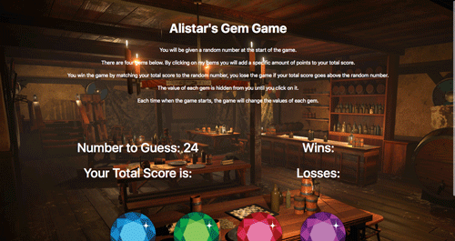

# Alistar's Gem Game
This is a fun and interactive game using JavaScript and jQuery to dynamically update the HTML. My DnD character, Alistar had an obsession with gems and would run his little gem game to con patrons all across our world.

### Game Interface

Instructions:
* You will be given a random number at the start of the game.
* There are four gems below. By clicking on my gems you will add a specific amount of points to your total score.
* You win the game by matching your total score to the random number, you lose the game if your total score goes above the random number.
* The value of each gem is hidden from you until you click on it.
* Each time when the game starts, the game will change the values of each gem.
* Make sure you turn on your volume to enjoy the full sound effect.

Click on the link to play!
https://cwbabis.github.io/Gem-Game/

### Built with
* HTML5
* CSS3
* JavaScript
* Bootstrap
* jQuery

Here's a preview of the game:

permalink: /index.html
